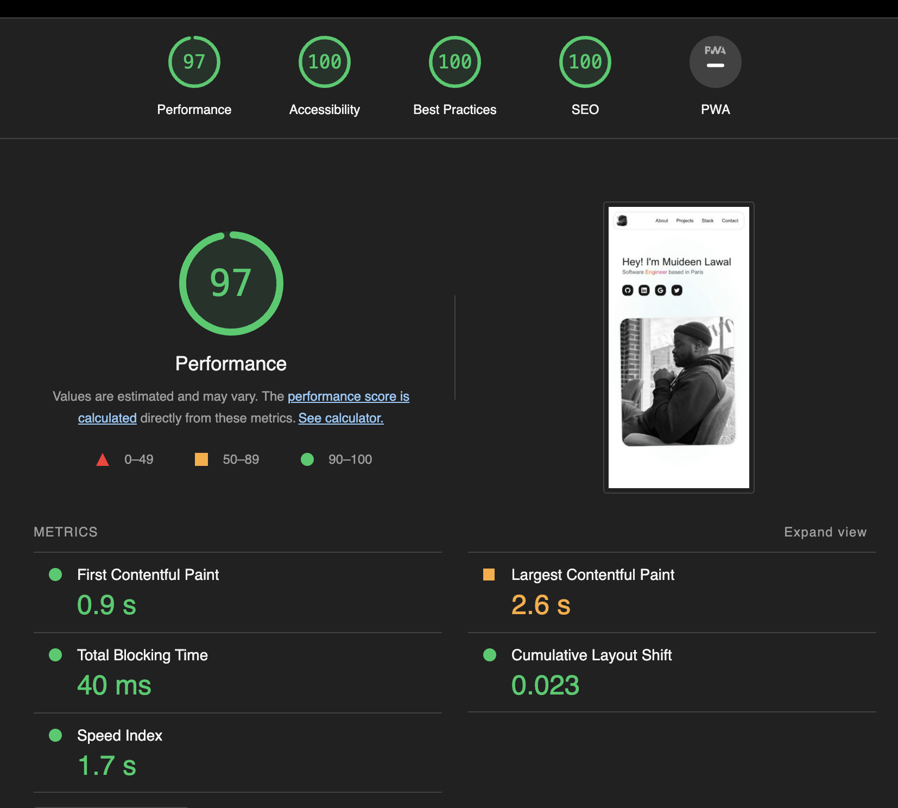

This is my portfolio website written with [Next.js](https://nextjs.org/).

It took a lot of time for me to push this out. The struggle to build a perfect portfolio website continues 😊, at least I have a starting point now.

<!-- This is a [Next.js](https://nextjs.org/) project bootstrapped with [`create-next-app`](https://github.com/vercel/next.js/tree/canary/packages/create-next-app). -->

## Cloning

Feel free to clone, modify and use this template as you wish but kindly remove all my personal information.

The lighthouse report is shown below.



## Getting Started

This project uses [Clash Grotesk](https://www.fontshare.com/fonts/clash-grotesk) and [IBM Plex Sans](https://fonts.google.com/specimen/IBM+Plex+Sans?query=ibm+plex+sans&sort=date) available through [`next/font`](https://nextjs.org/docs/basic-features/font-optimization).

First, run the development server:

```bash
npm run dev
# or
yarn dev
# or
pnpm dev
# or
bun dev
```

Open [http://localhost:3000](http://localhost:3000) with your browser to see the result.

You can start editing the page by modifying `app/page.tsx`. The page auto-updates as you edit the file.

<!-- This project uses [`next/font`](https://nextjs.org/docs/basic-features/font-optimization) to automatically optimize and load Inter, a custom Google Font. -->

## Learn More

To learn more about Next.js, take a look at the following resources:

- [Next.js Documentation](https://nextjs.org/docs) - learn about Next.js features and API.
- [Learn Next.js](https://nextjs.org/learn) - an interactive Next.js tutorial.

You can check out [the Next.js GitHub repository](https://github.com/vercel/next.js/) - your feedback and contributions are welcome!

## Deploy on Vercel

The easiest way to deploy your Next.js app is to use the [Vercel Platform](https://vercel.com/new?utm_medium=default-template&filter=next.js&utm_source=create-next-app&utm_campaign=create-next-app-readme) from the creators of Next.js.

Check out our [Next.js deployment documentation](https://nextjs.org/docs/deployment) for more details.


## References
Some links that were helpful during the development of this website are listed below. Images used on this site (apart from my personal photo) comes from [Unsplash](https://unsplash.com)

- [delba.dev](https://delba.dev/blog/next-blog-build-time-syntax-highlighting): syntax highlighting
- [Image 1](https://unsplash.com/photos/a-blue-and-white-wall-with-a-pattern-on-it-YtEob7T5CwU): featured image on blog
- [Image 2](https://unsplash.com/photos/orange-pink-and-teal-illustration-Tk0B3Dfkf_4): featured image on blog
- [Image 3](https://unsplash.com/photos/a-painting-of-a-multicolored-pattern-with-a-white-background-chcyjyRQV74): featured image on blog